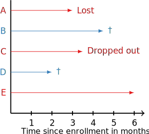

.. understanding_predictions

Understanding Predictions in Survival Analysis
==============================================

What is Survival Analysis?
--------------------------

The objective in survival analysis — also referred to as reliability analysis in engineering — is to establish
a connection between covariates and the time of an event. The name *survival analysis* originates from
clinical research, where predicting the time to death, i.e., survival, is often the main objective.
Survival analysis is a type of regression problem (one wants to predict a continuous value), but with a twist.
It differs from traditional regression by the fact that parts of the training data can only be partially
observed – they are *censored*.

As an example, consider a clinical study, which investigates cardiovascular disease and has been carried out over a
1 year period as in the figure below.

Patient A was lost to follow-up after three months with no recorded cardiovascular event, patient B experienced an event
four and a half months after enrollment, patient C withdrew from the study three and a half months after enrollment,
and patient E did not experience any event before the study ended. Consequently, the exact time of a
cardiovascular event could only be recorded for patients B and D; their records are *uncensored*.
For the remaining patients it is unknown whether they did or did not experience an event after termination of the study.
The only valid information that is available for patients A, C, and E is that they were event-free up to their
last follow-up. Therefore, their records are *censored*.

Formally, each patient record consists of a set of covariates :math:`x \in \mathbb{R}^d` , and the time
:math:`t>0` when an event
occurred or the time :math:`c>0` of censoring. Since censoring and experiencing and event are mutually exclusive,
it is common to define an event indicator :math:`\delta \in \{0;1\}` and the observable survival time :math:`y>0`.
The observable time :math:`y` of a right censored sample is defined as

.. math::

    y = \min(t, c) =
    \begin{cases}
    t & \text{if } \delta = 1 , \\
    c & \text{if } \delta = 0 .
    \end{cases}

Consequently, survival analysis demands for models that take this unique characteristic of such a dataset into account.

Basic Quantities
----------------

Rather than focusing on predicting a single point in time of an event, the prediction step in survival analysis
often focuses on predicting a function: either the survival or hazard function.
The survival function :math:`S(t)` returns the probability of survival beyond time :math:`t`, i.e.,
:math:`S(t) = P(T > t)`, whereas the hazard function :math:`h(t)` denotes an approximate
probability (it is not bounded from above) that an event occurs in the small time
interval :math:`[t; t + \Delta t[`, under the condition that an individual would remain event-free
up to time :math:`t`:

.. math::

    h(t) = \lim_{\Delta t \rightarrow 0} \frac{P(t \leq T < t + \Delta t \mid T \geq t)}{\Delta t} \geq 0 .

Alternative names for the hazard function are *conditional failure rate*, *conditional
mortality rate*, or *instantaneous failure rate*. In contrast to the survival function, which
describes the absence of an event, the hazard function provides information about the
occurrence of an event.
Finally, the cumulative hazard function :math:`H(t)` is the integral over the interval :math:`[0; t]`
of the hazard function:

.. math::

    H(t) = \int_0^t h(u)\,du .

Predictions
-----------

The survival function :math:`S(t)` and cumulative hazard function :math:`H(t)` can be estimated
from a set of observed time points :math:`\{(y_1, \delta_i), \ldots, (y_n, \delta_n)\}` using
:func:`sksurv.nonparametric.kaplan_meier_estimator` and :func:`sksurv.nonparametric.nelson_aalen_estimator`,
respectively.

The above estimators are often too simple, because they do not take additional factors into account
that could affect survival, e.g. age or a pre-existing condition.
Cox's proportional hazards model (:class:`sksurv.linear_model.CoxPHSurvivalAnalysis`) provides
a way to estimate survival and cumulative hazard function in the presence of additional covariates.
This is possible, because it assumes that a baseline hazard function exists and that covariates
change the "risk" (hazard) only proportionally. In other words, it assumes that the ratio of
the "risk" of experiencing an event of two patients remains constant over time.
After fitting Cox's proportional hazards model, :math:`S(t)` and :math:`H(t)` can be estimated
using :meth:`sksurv.linear_model.CoxPHSurvivalAnalysis.predict_survival_function` and
:func:`sksurv.linear_model.CoxPHSurvivalAnalysis.predict_cumulative_hazard_function`, respectively.

.. important::

    For other survival models that do not rely on the proportional hazards assumption,
    it is often impossible to estimate survival or cumulative hazard function.
    Their predictions are risk scores of arbitrary scale. If samples are ordered according to
    their predicted risk score (in ascending order), one obtains the sequence of events,
    as predicted by the model.
    This is the return value of the :func:`predict()` method of **all survival models in scikit-survival**.

    Consequently, predictions are often evaluated by a measure of rank correlation between predicted risk scores
    and observed time points in the test data. In particular, Harrell's concordance index
    (:func:`sksurv.metrics.concordance_index_censored`) computes the ratio of correctly ordered
    (concordant) pairs to comparable pairs and is the default performance metric when calling
    a survival model's :func:`score()` method.
